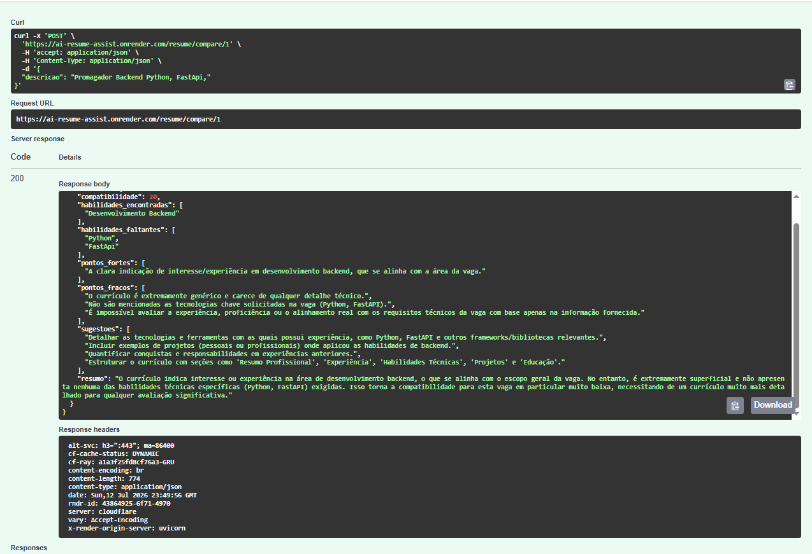

<p align="center">
  
</p>

# AI Resume Assist


AI Resume Assist is a backend application that analyzes PDF resumes using Google Gemini AI.

The application extracts text from PDF files, identifies technologies and experience, generates professional summaries, compares resumes with job descriptions and stores the results in PostgreSQL.

This project was developed to practice building production-style backend applications with FastAPI, Docker, PostgreSQL and Generative AI.

---

# 🚀 Live Demo

### API

https://ai-resume-assist.onrender.com

### Swagger Documentation

https://ai-resume-assist.onrender.com/docs

---

# 📷 Screenshots

## Swagger

<p align="center">

</p>

---

## Resume Comparison

<p align="center">

</p>

---

# Workflow

```text
                 Resume.pdf
                      │
                      ▼
          Text Extraction (PyMuPDF)
                      │
                      ▼
             Google Gemini AI
                      │
          ┌───────────┴───────────┐
          ▼                       ▼
 Resume Analysis          Job Comparison
          │                       │
          └───────────┬───────────┘
                      ▼
                 PostgreSQL
                      │
                      ▼
                JSON Response
```

---

# Features

- Upload PDF resumes
- Automatic text extraction with PyMuPDF
- Resume analysis using Google Gemini AI
- Technology detection
- Experience estimation
- Professional summary generation
- Resume vs Job Description comparison
- Structured JSON responses
- PostgreSQL persistence
- REST API built with FastAPI
- Docker environment
- Interactive Swagger documentation

---

# Tech Stack

| Technology | Purpose |
|------------|---------|
| Python | Backend |
| FastAPI | REST API |
| SQLAlchemy | ORM |
| PostgreSQL | Database |
| Google Gemini | AI Analysis |
| PyMuPDF | PDF Extraction |
| Docker | Containerization |
| Docker Compose | Local Development |
| Render | Cloud Deployment |

---

# Project Structure

```text
app/
│
├── models/
├── routes/
├── schemas/
├── services/
│
├── database.py
├── create_db.py
└── main.py

assets/
│
├── banner.png
├── swagger.png
└── comparison.png

Dockerfile
docker-compose.yml
requirements.txt
README.md
```

---

# API Endpoints

| Method | Endpoint | Description |
|---------|----------|-------------|
| POST | /resume/ | Create Resume |
| GET | /resume/ | List Resumes |
| GET | /resume/{id} | Get Resume |
| PUT | /resume/{id} | Update Resume |
| DELETE | /resume/{id} | Delete Resume |
| POST | /resume/upload/{id} | Upload and Analyze PDF |
| POST | /resume/compare/{id} | Compare Resume with Job Description |
| GET | /resume/health | Health Check |

---

# Running Locally

Clone the repository

```bash
git clone https://github.com/GustavoJacovozzi/ai-resume-assist.git
```

Enter the project

```bash
cd ai-resume-assist
```

Create a `.env`

```env
GEMINI_API_KEY=your_gemini_api_key

DATABASE_URL=postgresql://postgres:gustavo123@db:5432/airesume
```

Run Docker

```bash
docker compose up --build
```

Open Swagger

```
http://localhost:8000/docs
```

---

# Example Workflow

```
Upload Resume

↓

Extract PDF Text

↓

Google Gemini

↓

Resume Analysis

↓

Save into PostgreSQL

↓

Return JSON
```

---

# Future Improvements

- JWT Authentication
- Automated Tests
- GitHub Actions CI/CD
- Resume History
- Async Background Tasks
- Frontend Dashboard

---

# Author

**Gustavo Jacobozzi**

Backend Developer

Python • FastAPI • PostgreSQL • Docker • Artificial Intelligence

---

If you have suggestions or find any issues, feel free to open an Issue or submit a Pull Request.
